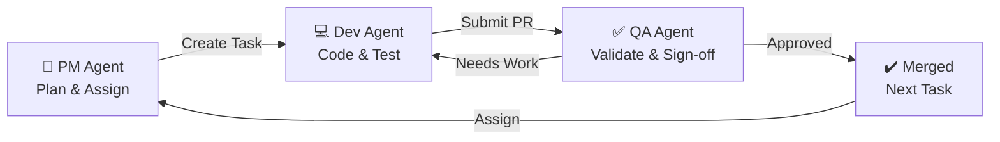

# ASP to React Migration Framework

> A comprehensive template and workflow guide for migrating large-scale Classic ASP applications to modern React + Web API stack using GitHub Copilot multi-agent collaboration.

## 📋 Project Overview

This repository serves as the **planning hub and execution framework** for migrating a 20-year-old Classic ASP admin application (100+ pages, multiple modules, MSSQL databases) to a modern tech stack.

**Current State:**
- Platform: Classic ASP (VBScript)
- Scale: 100+ pages across multiple modules
- Databases: MSSQL + Legacy systems (OLDBE)
- Status: Active in production
- Source Control: SVN

**Target State:**
- Frontend: React 18+ with TypeScript
- Backend: Web API (Node.js/Express or ASP.NET Core)
- Database: MSSQL (modernized schema)
- Deployment: Docker/CI-CD ready
- Testing: Automated E2E + Unit tests

---

## 🎯 Quick Start Guide

### 1. **Understand the Migration Strategy**
Read: [`docs/MIGRATION_STRATEGY.md`](docs/MIGRATION_STRATEGY.md)
- Phased approach (Phase 0-3)
- Risk assessment
- Timeline estimates

### 2. **Review Phase Breakdown**
Read: [`docs/PHASE_BREAKDOWN.md`](docs/PHASE_BREAKDOWN.md)
- What happens in each phase
- Module grouping
- Dependencies

### 3. **Catalog Your 100+ Pages**
Use template: [`docs/MODULE_INVENTORY.md`](docs/MODULE_INVENTORY.md)
- List each module
- Identify pages, tables, dependencies
- Estimate complexity

### 4. **Review Conversion Patterns**
Read: [`docs/CONVERSION_PATTERNS.md`](docs/CONVERSION_PATTERNS.md)
- How ASP code translates to React/API
- Best practices
- Common pitfalls

### 5. **Set Up Copilot Agents**
Read: [`docs/COPILOT_AGENT_SETUP.md`](docs/COPILOT_AGENT_SETUP.md)
- PM Agent instructions
- Dev Agent instructions
- QA Agent instructions
- Credit budget planning

---

## 🏗️ Architecture Overview

```
┌─────────────────────────────────────────────────────────┐
│           React Frontend (SPA)                          │
│  - Component Library (Pages, Forms, Dialogs)            │
│  - State Management (Context/Redux)                     │
│  - Authentication (JWT/OAuth)                           │
│  - Routing & Navigation                                 │
└────────────────┬────────────────────────────────────────┘
                 │ HTTPS/REST
┌────────────────▼────────────────────────────────────────┐
│           Web API (Node.js/ASP.NET Core)               │
│  - Authentication & Authorization                       │
│  - Business Logic Layer                                 │
│  - Data Access Layer                                    │
│  - Database Abstraction                                 │
└────────────────┬────────────────────────────────────────┘
                 │ SQL
┌────────────────▼────────────────────────────────────────┐
│           MSSQL Database                                │
│  - Modernized schema                                    │
│  - Migration from legacy systems                        │
└─────────────────────────────────────────────────────────┘
```

---

## 📦 Repository Structure

```
asp-to-react-migration-template/
├── README.md                          # This file
├── docs/
│   ├── MIGRATION_STRATEGY.md          # High-level approach
│   ├── PHASE_BREAKDOWN.md             # Phase 0-3 details
│   ├── MODULE_INVENTORY.md            # Template for cataloging 100+ pages
│   ├── DATABASE_MAPPING.md            # Legacy DB → Modern schema
│   ├── ARCHITECTURE_DESIGN.md         # React + API architecture
│   ├── CONVERSION_PATTERNS.md         # ASP → React/API patterns
│   ├── COPILOT_AGENT_SETUP.md        # Agent configuration & workflow
│   ├── WORKFLOW.md                    # PM → Dev → QA cycle
│   └── SETUP_INSTRUCTIONS.md          # Environment setup
├── migration/
│   ├── LEGACY_ASP_SAMPLES/
│   │   ├── login.asp                  # Auth example
│   │   ├── product-management.asp     # CRUD example
│   │   ├── dashboard.asp              # Dashboard example
│   │   ├── utility-functions.asp      # Common utilities
│   │   └── database-queries.asp       # Query patterns
│   └── TOOLS/
│       └── ast-analyzer.js            # Helper to analyze ASP code
├── frontend/
│   ├── README.md                      # React setup guide
│   ├── package.json
│   ├── src/
│   │   ├── components/
│   │   │   ├── LoginForm.tsx          # Auth component
│   │   │   ├── ProductManagement.tsx  # CRUD example
│   │   │   ├── DashboardPage.tsx      # Dashboard example
│   │   │   └── CommonLayout.tsx       # Shared layout
│   │   ├── hooks/
│   │   │   ├── useAuth.ts
│   │   │   └── useApi.ts
│   │   ├── services/
│   │   │   ├── api.ts                 # API client
│   │   │   └── auth.ts
│   │   ├── types/
│   │   │   └── index.ts               # TypeScript types
│   │   ├── App.tsx
│   │   └── index.tsx
│   └── __tests__/
│       └── example.test.tsx
├── backend/
│   ├── README.md                      # API setup guide
│   ├── package.json
│   ├── src/
│   │   ├── routes/
│   │   │   ├── auth.js                # Auth endpoints
│   │   │   ├── products.js            # Product endpoints (CRUD example)
│   │   │   └── users.js               # User management
│   │   ├── middleware/
│   │   │   ├── auth.js
│   │   │   └── errorHandler.js
│   │   ├── services/
│   │   │   ├── userService.js
│   │   │   └── productService.js
│   │   ├── db/
│   │   │   ├── connection.js
│   │   │   └── migrations/
│   │   ├── config/
│   │   │   └── database.config.js
│   │   └── server.js
│   └── __tests__/
│       └── example.test.js
├── .github/
│   ├── ISSUE_TEMPLATE/
│   │   ├── dev-task.md                # For Dev Agent
│   │   ├── qa-testing.md              # For QA Agent
│   │   └── pm-planning.md             # For PM Agent
│   └── workflows/
│       ├── auto-label-assign.yml      # Auto-route issues to agents
│       ├── dev-pr-checks.yml          # Run tests on PR
│       └── deployment.yml             # CI/CD pipeline
├── PROJECT_PLAN.md                    # Roadmap & timeline
└── CONTRIBUTING.md                    # Development guidelines
```

---

## 🤖 Copilot Multi-Agent Workflow

This framework enables a three-agent workflow that mirrors real software development:

### PM Agent → Dev Agent → QA Agent → Repeat



**Phase 1 - Planning (PM Agent)**
- Breaks down modules into actionable tasks
- Creates GitHub issues with requirements
- Assigns to Dev Agent
- Tracks progress

**Phase 2 - Development (Dev Agent)**
- Develops React components
- Creates Web API endpoints
- Writes unit tests (>80% coverage)
- Opens PR with documentation
- Updates PM Agent on progress

**Phase 3 - QA (QA Agent)**
- Creates test scenarios
- Validates against legacy ASP behavior
- Runs end-to-end tests
- Reports findings
- Approves or requests changes

**Cycle repeats** for next module/feature

---

## 📊 Module Organization

Your 100+ pages should be organized into logical modules. Example:

```
Admin App
├── Authentication Module (5-10 pages)
├── User Management Module (8-12 pages)
├── Product Management Module (10-15 pages)
├── Order Processing Module (12-18 pages)
├── Reporting Module (15-20 pages)
├── Settings & Config Module (5-8 pages)
└── Integrations Module (varies)
```

Each module becomes:
1. **1 Dev Agent task** (implement React + API)
2. **1 QA Agent task** (validate & test)

---

## 💰 Copilot Pro+ Credit Management

For Copilot Pro+ users ($39/month with ~2,000 AI credits):

**Typical Credit Usage per Module:**
- PM planning & task creation: 50-100 credits
- Dev Agent development: 300-600 credits (depending on complexity)
- QA Agent testing: 150-300 credits
- **Total per module: 500-1,000 credits**

**With 2,000 credits/month:** 2-4 modules can be migrated simultaneously or 4-8 sequentially

**Credit Optimization Tips:**
1. Write clear, detailed requirements (reduces Dev back-and-forth)
2. Provide ASP code samples in task descriptions
3. Use issue templates to standardize format
4. Reference conversion patterns to reduce duplication
5. Batch similar modules together

---

## 🚀 Getting Started Checklist

- [ ] Read [`docs/MIGRATION_STRATEGY.md`](docs/MIGRATION_STRATEGY.md)
- [ ] Review [`docs/PHASE_BREAKDOWN.md`](docs/PHASE_BREAKDOWN.md)
- [ ] Complete [`docs/MODULE_INVENTORY.md`](docs/MODULE_INVENTORY.md) for your app
- [ ] Review sample ASP code in [`migration/LEGACY_ASP_SAMPLES/`](migration/LEGACY_ASP_SAMPLES/)
- [ ] Review sample React components in [`frontend/src/components/`](frontend/src/components/)
- [ ] Review sample API endpoints in [`backend/src/routes/`](backend/src/routes/)
- [ ] Set up Copilot agents per [`docs/COPILOT_AGENT_SETUP.md`](docs/COPILOT_AGENT_SETUP.md)
- [ ] Create first task from PM Agent template (`.github/ISSUE_TEMPLATE/pm-planning.md`)
- [ ] Assign to Dev Agent and watch it work!

---

## 📚 Documentation Map

| Document | Purpose | Audience |
|----------|---------|----------|
| [MIGRATION_STRATEGY.md](docs/MIGRATION_STRATEGY.md) | High-level approach & timeline | Everyone |
| [PHASE_BREAKDOWN.md](docs/PHASE_BREAKDOWN.md) | What happens in each phase | PM & Planning |
| [MODULE_INVENTORY.md](docs/MODULE_INVENTORY.md) | Catalog your 100+ pages | PM & Everyone |
| [DATABASE_MAPPING.md](docs/DATABASE_MAPPING.md) | Legacy DB to modern schema | Dev & DB Admin |
| [ARCHITECTURE_DESIGN.md](docs/ARCHITECTURE_DESIGN.md) | React + API architecture | Dev & Tech Lead |
| [CONVERSION_PATTERNS.md](docs/CONVERSION_PATTERNS.md) | ASP → React/API patterns | Dev Agent |
| [COPILOT_AGENT_SETUP.md](docs/COPILOT_AGENT_SETUP.md) | Configure Copilot agents | PM & Tech Lead |
| [WORKFLOW.md](docs/WORKFLOW.md) | PM → Dev → QA cycle | Everyone |
| [SETUP_INSTRUCTIONS.md](docs/SETUP_INSTRUCTIONS.md) | Environment setup | Dev |

---

## 🛠️ Technology Stack

### Frontend
- **React 18+** with TypeScript
- **State Management**: Context API or Redux
- **UI Framework**: Material-UI, Ant Design, or similar
- **Testing**: Jest + React Testing Library
- **Build**: Vite or Create React App

### Backend
- **Node.js + Express** (recommended for ASP conversion)
  - OR **ASP.NET Core** (if staying in Microsoft ecosystem)
- **Database**: MSSQL with modern ORM (Entity Framework or Sequelize)
- **Authentication**: JWT or OAuth 2.0
- **API Documentation**: Swagger/OpenAPI
- **Testing**: Jest or xUnit

### Database
- **Current**: MSSQL + Legacy systems (OLDBE)
- **Target**: MSSQL (modernized schema)
- **Migration Tool**: Data2Sync or SSMA (SQL Server Migration Assistant)

### DevOps
- **CI/CD**: GitHub Actions
- **Containerization**: Docker
- **Hosting**: Azure, AWS, or on-premises IIS

---

## 📖 Reference Material

**ASP to React Migration Resources:**
- [Microsoft: ASP.NET to ASP.NET Core Migration Guide](https://docs.microsoft.com/en-us/dotnet/architecture/modernize-with-azure-containers/)
- [React Official Docs](https://react.dev/)
- [Node.js Best Practices](https://github.com/goldbergyoni/nodebestpractices)
- [Clean Code in TypeScript](https://github.com/labs42io/clean-code-typescript)

---

## 📝 Next Steps

1. **Fill in your Module Inventory** (`docs/MODULE_INVENTORY.md`)
   - List all 100+ pages by module
   - Identify database tables
   - Estimate complexity

2. **Review Phase 0 (Foundation)**
   - Set up React project
   - Set up Web API project
   - Create auth framework

3. **Create First Dev Task**
   - Use `.github/ISSUE_TEMPLATE/dev-task.md`
   - Assign to Copilot Agent
   - Watch it develop!

4. **Create First QA Task**
   - Validate completed development
   - Ensure parity with ASP version

5. **Measure & Iterate**
   - Track credit usage
   - Refine process based on learnings
   - Accelerate with team

---

## 🤝 Contributing

See [`CONTRIBUTING.md`](CONTRIBUTING.md) for guidelines on:
- Adding new conversion patterns
- Documenting lessons learned
- Improving templates
- Sharing best practices

---

## 📄 License

This template is provided as-is for internal use. Customize and adapt as needed for your organization.

---

## ❓ FAQ

**Q: How long will this migration take?**
A: Depends on your team capacity and complexity. Using Copilot agents, expect 4-8 months for a 100-page app with 2-3 developers.

**Q: Can I run old ASP and new React in parallel?**
A: Yes! Use URL routing or feature flags to gradually migrate users from ASP to React pages.

**Q: What about the legacy OLDBE database?**
A: Plan data migration separately. Use SSMA or custom scripts. May happen before, during, or after code migration.

**Q: How do I ensure no features are lost?**
A: The QA Agent will validate each migrated feature against the original ASP behavior. Document all features in Module Inventory.

**Q: Do I need to rewrite everything?**
A: Not exactly. Reusable logic moves to API layer, UI gets rewritten in React. Business logic often stays similar.

---

**Ready to start?** Begin with [`docs/MIGRATION_STRATEGY.md`](docs/MIGRATION_STRATEGY.md) 🚀
